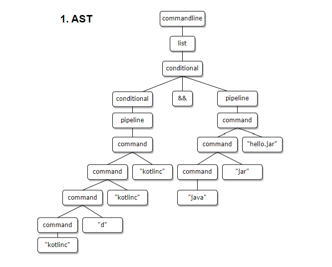

### *Author: Erin Phillips*

### *Date: 10/20/2022*

# **CSCI 320 - Assignment 6**

## **hw6.kt README**
### How it works:
This program demonstrates a kotlin function that accepts a text file name as a command line argument. The text file contains a list of names. For each line of the text file (each name) the first and last initals are extracted as well as the whole name. These pieces of data are stored in a map, with initials as the key, and full name as the value. This is done, gracefully (I think, or I hope) in one line of code using string formatting.
After the file is proccessed, the user is prompted to enter initials to search, providing a message on whether or not it is found. This continues until the user interrupts the program with `ctr+c`

### Running hw6.kt
The following commands:

`kotlinc hw6.kt -include-runtime -d hw6.jar`\
`java -jar hw6.jar <filename.txt>`

Alternatively,

`kotlinc hw6.kt -include-runtime -d hw6.jar && java -jar hw6.jar <filename.txt>`

### Issues
- I was not able to compile and run with the commands given in the kotlin how to. Upon researching, I found that using `-include-runtime-` includes the kotlin runtime library, which makes it "runnable". I'm not sure why this was the only way I could run it. See [Kotlin Compile/Run][1]
- I was unable to implement the while loop(for user input - searching for the initials) to be case-insensitive. I used `.uppercase()`(experimental), `uppercaseChar()`(experimental), & `toUpperCase()`(depracated). So, that part of the program is *case-sensitive.*
- Instructions stated to accept initials from the console until `cntl+d` is pressed. I struggled to get this to work in my case. `cntl+d` is an EOT signal, representing the "End of Transmission". The loop will only break out with `cntl+c` 
    - I struggled to design the if-condition to check if the input was EOT.

[1]:https://www.codevscolor.com/how-to-run-kotlin-program-command-line
___

## **Kotlin Syntax Processing:**

### 1. `kotlinc d hello.jar hello.kt && java jar hello.jar`

#### 1.a Derivation:
<!-- This comment is added for readability of the derivations if looking at raw code
| Prod   | Result |
| :----: | :----- |
| (1)    | commandline  
| (1)    | list  
| (2)    | conditional  
| (3)    | conditional && pipeline  
| (3)    | pipeline && pipeline  
| (4)    | command && pipeline  
| (5)    | command "hello.kt" && pipeline  
| (5)    | command "hello.jar" "hello.kt" && pipeline  
| (5)    | command "d" "hello.jar" "hello.kt" && pipeline  
| (5)    | "kotlinc" "d" "hello.jar" "hello.kt" && pipeline  
| (4)    | "kotlinc" "d" "hello.jar" "hello.kt" && command 
| (5)    | "kotlinc" "d" "hello.jar" "hello.kt" && command "hello.jar"
| (5)    | "kotlinc" "d" "hello.jar" "hello.kt" && command "jar" "hello.jar"
| (5)    | "kotlinc" "d" "hello.jar" "hello.kt" && "java" "jar" "hello.jar"
 -->

| Production | Result  |
| :--------: | :------ |
|(1) (1) (2) (3) (3) (4) (5) (5) (5) (5) (4) (5) (5) (5) |commandline list conditional conditional && pipeline pipeline && pipeline command && pipeline command "hello.kt" && pipeline command "hello.jar" "hello.kt" && pipeline command "d" "hello.jar" "hello.kt" && pipeline "kotlinc" "d" "hello.jar" "hello.kt" && pipeline "kotlinc" "d" "hello.jar" "hello.kt" && command "kotlinc" "d" "hello.jar" "hello.kt" && command "hello.jar" "kotlinc" "d" "hello.jar" "hello.kt" && command "jar" "hello.jar" "kotlinc" "d" "hello.jar" "hello.kt" && java "jar" "hello.jar" 
|      |         |

#### 1.b Abstract Syntax Tree

### 2. `find name something | grep hello 2> somefile`

#### 2.a Derivation
<!-- This comment is added for readability of the derivations if looking at raw code
| Prod   | Result |
| :----: | :----- |
| (1)    | commandline  
| (1)    | list  
| (2)    | conditional   
| (3)    | pipeline  
| (4)    | pipeline | command
| (4)    | command  | command  
| (5)    | command "something"  | command
| (5)    | command "name" "something" | command
| (5)    | "find" "name" "something"  | command
| (5)    | "find" "name" "something"  | command redirection
| (5)    | "find" "name" "something"  | command "hello" redirection
| (5)    | "find" "name" "something"  | "grep" "hello" redirection
| (6)    | "find" "name" "something"  | "grep" "hello" redirectionop filename
| (7)    | "find" "name" "something"  | "grep" "hello" "2>" filename
| (6)    | "find" "name" "something"  | "grep" "hello" "2>" "somefile"
 -->

| Production | Result  |
| :--------: | :------ |
|(1) (1) (2) (3) (4) (4) (5) (5) (5) (5) (5) (5) (6) (7) (6) |commandline list conditional pipeline pipeline \| command command \| command command "something \| command command "name" "something" \| command "find" "name" "something" \| command "find" "name" "something" \| command redirection "find" "name" "something" \| command "hello" redirection "find" "name" "something" \| "grep" "hello" redirection "find" "name" "something" \| "grep" "hello" redirectionop filename "find" "name" "something" \| "grep" "hello" "2>" filename "find" "name" "something" \| "grep" "hello" "2>" "somefile" 
|      |         |

#### 2.b Abstract Syntax Tree

