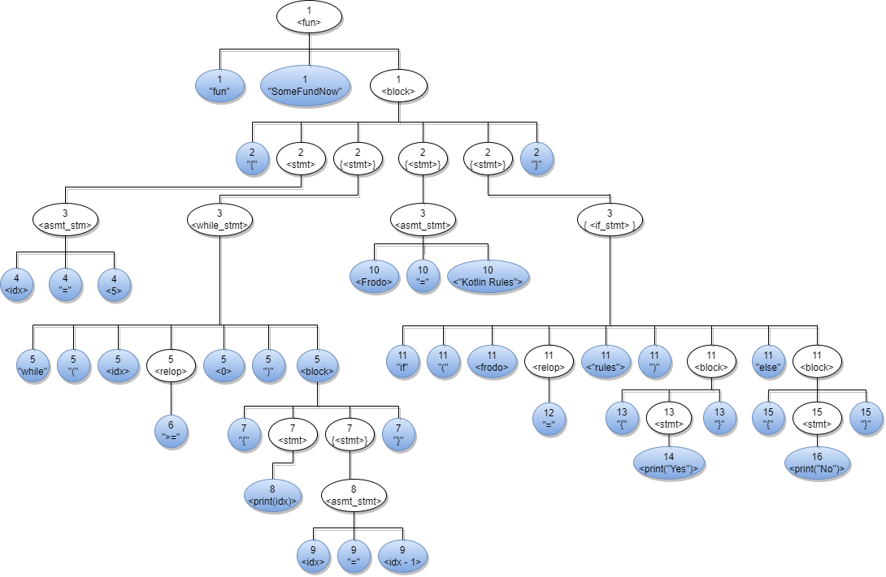

### *Author: Erin Phillips*
### *Date: 10/31/2022*
### *readme-hw7.md*

# **CSCI 320 - Assignment 7**

## **README**
### *How it works:*
This program demonstrates a kotlin list-processing function that accepts a list of words on the command line. The words are stored in a list, each element being a single word. The list function `map{}` is used to process the list in a meaningful manner. The average word length and standard deviation of word length is calculated using the previously mentioned list function. 

### **Issues**
I did not experience any issues developing this program.
___

## **Kotlin Syntax Processing:**

### *1.a. Graphical Syntax Diagrams*

### *1.b Derivation:*

| Production  |-> | Derivation |
| :---------  |:--| :----  |
|\<fun>        |-> | "fun" \<SomeFundNow> block
|\<block>      |-> | "{" \<stmt> { \<stmt> } { \<stmt> } { \<stmt> } "}"
|\<stmt>       |-> | "{" \<asmt_stmt> { \<while_stmt> } { \<asmt_stmt> } { \<if_stmt> }"}"
|\<asmt_stmt>  |-> | \<idx> "=" <5>
|\<while_stmt> |-> | "while" "(" \<idx> \<relop> \<0> ")" \<block>
|\<relop>      |-> | ">="
|\<block>      |-> | "{" \<stmt> { \<stmt> } "}"
|\<stmt>       |-> | \<print(idx>)> \<asmt_stmt>
|\<asmt_stmt>  |-> | \<idx> "=" \<idx - 1>
|\<asmt_stmt>  |-> | \<frodo> "=" \<"Kotlin rules">
|\<if_stmt>    |-> | "if" "(" \<frodo> \<relop> \<"rules"> ")" \<block> ["else" |\<block>]
|\<relop>      |-> | "=="
|\<block>      |-> | "{" \<stmt> "}"
|\<stmt>       |-> | \<print("Yes")>
|\<block>      |-> | "{" \<stmt> "}"
|\<stmt>       |-> | \<print("No")>

    "fun" <SomeFundNow> 
    "{" <idx> "=" <5> 
    { "while" "(" <idx> ">=" <0> ")" "{" <print(idx>)> <idx> "=" <idx - 1> "}" } 
    { <frodo> "=" <"Kotlin rules"> } 
    { if" "(" <frodo> "==" <"rules"> ")" "{" <print("Yes") "}" ["else" "{" <print("No")> "}" ] 
    } "}"

### *1.c Abstract Syntax Tree*

